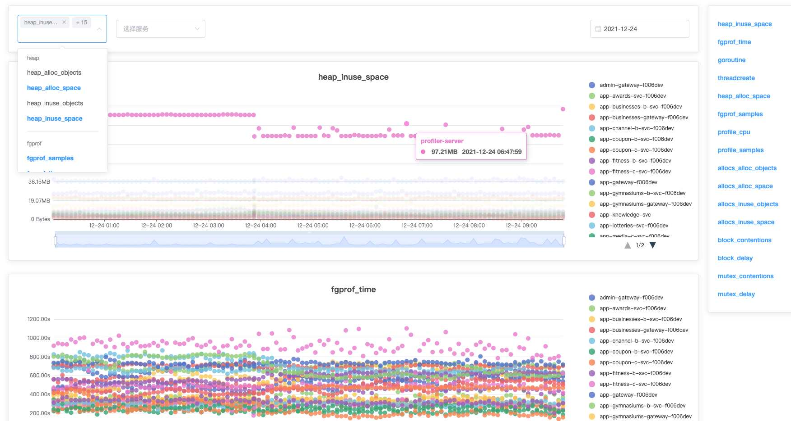
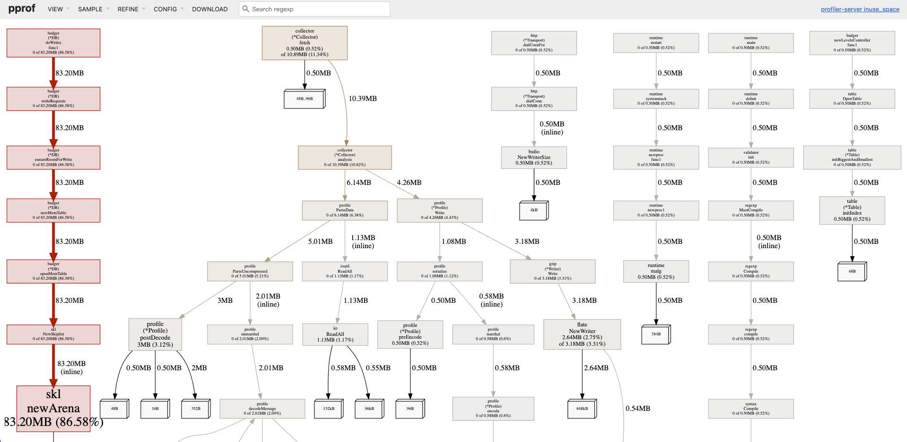
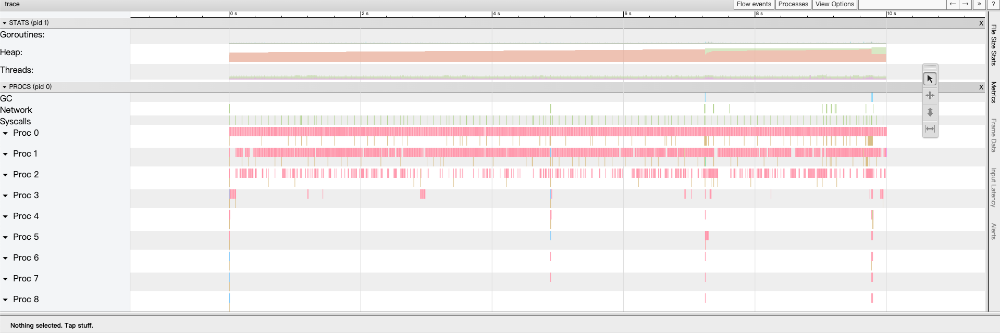

# Continuous profiling for golang program

[](https://goreportcard.com/report/github.com/xyctruth/profiler)
[](https://codecov.io/gh/xyctruth/profiler)
[](https://github.com/xyctruth/profiler/actions/workflows/server-build.yml)

## [Demo](https://profiling.jia-huang.com)



### Click Point Open Profile UI 



### Click Trace Charts Point Open Trace UI



## Quick Start

需要被收集分析的 `golang` 程序,需要提供 `net/http/pprof` 端点，并配置在 `./collector.yaml` 配置文件中

程序会 watch `collector.yaml` 配置文件变化, 实时加载变化的配置

### Dev
```bash
     # run server :8080
    go run server/main.go 
     # run ui :80
    cd ui && npm install --registry=https://registry.npm.taobao.org  &&  npm run dev --base_api_url=http://localhost:8080 
```

### In Docker
```bash
    # No persistence
    docker run -d -p 80:80 --name profiler xyctruth/profiler:latest

    # Bind mount a volume
    mkdir -vp ~/profiler/config/
    cp ./collector.yaml ~/profiler/config/
    docker run -d -p 80:80 -v ~/profiler/data/:/profiler/data/ -v ~/profiler/config/:/profiler/config/ --name profiler xyctruth/profiler:latest
```
